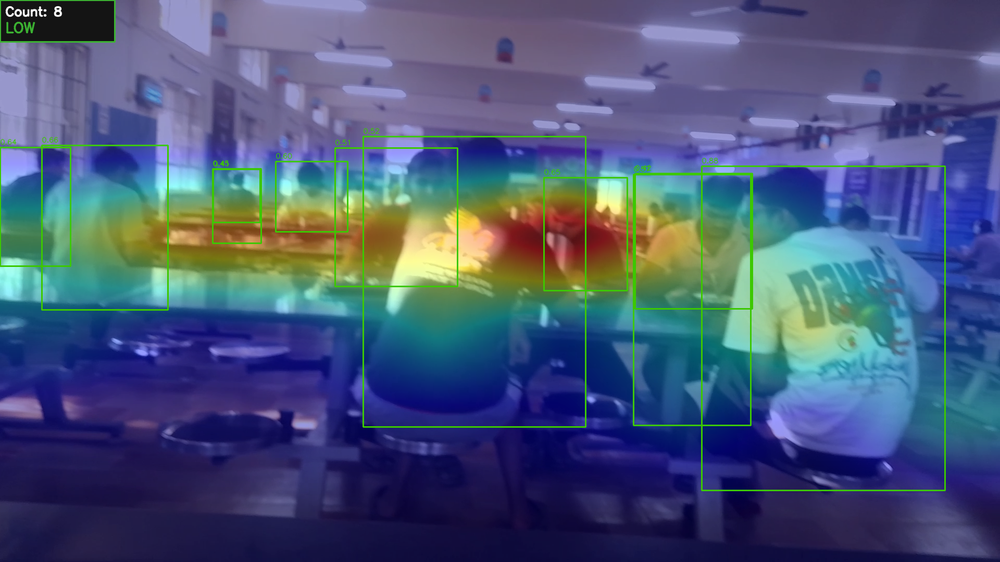
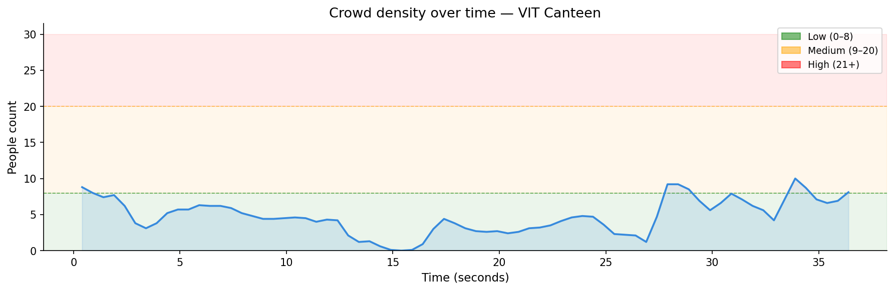

# VIT Canteen Crowd Density Estimator

A computer vision system that analyses video footage of the VIT Bhopal canteen and produces a real-time person count, spatial density heatmap, and a Low / Medium / High occupancy signal — helping students decide when to visit before walking there.

Built as a Computer Vision capstone project using YOLOv8n, OpenCV, and NumPy. Runs entirely on CPU via Google Colab — no GPU required.

---

## Demo

| Annotated output frame | Crowd trend over time |
|---|---|
|  |  |

> **Green boxes** — detected individuals (confidence ≥ 0.40)  
> **Heatmap** — blue = sparse, red = dense (serving area / queue zones)  
> **Top-left panel** — smoothed count + Low / Medium / High occupancy label

---

## What it does

Given a video recording of the canteen, the system:

1. **Detects people** in each frame using YOLOv8n (pre-trained on COCO, class = `person`, no GPU needed)
2. **Counts and smooths** detections using a 10-frame rolling mean to eliminate per-frame jitter
3. **Maps spatial density** by accumulating detections into an 8×6 grid, applying Gaussian blur, and overlaying a JET colourmap heatmap — showing *where* the crowd is clustered, not just how many people are present
4. **Classifies occupancy** as Low / Medium / High based on thresholds calibrated to the actual canteen capacity
5. **Saves an annotated video** and generates a crowd trend chart and evaluation report

---

## Project structure

```
crowd-density-estimator/
├── crowd_density_estimator.ipynb   # Main Colab notebook (run this)
├── assets/
│   ├── annotated_frame.png         # Sample output frame
│   ├── crowd_trend.png             # Crowd trend chart
│   └── evaluation_results.png      # MAE + predicted vs ground truth
├── report/
│   └── cv_capstone_report.pdf     # Full project report
└── README.md
```

---

## Quickstart

### Option A — Google Colab (recommended, no setup)

1. Open the notebook in Colab:

   [](https://colab.research.google.com/github/Shrishkd/crowd-density-estimator/blob/main/crowd_density_estimator.ipynb)

2. Run **Cell 1** to install dependencies (~60 seconds)
3. Run **Cell 2** to load configuration — edit thresholds if needed
4. Run **Cell 3** to upload your canteen video
5. Run **Cells 4–7** in order to process the video
6. Run **Cell 8** for the trend chart, **Cell 9** for evaluation, **Cell 10** to download outputs

> The notebook has detailed comments in every cell explaining what each step does and why.

---

### Option B — Run locally

**Requirements:** Python 3.9+

```bash
git clone https://github.com/Shrishkd/crowd-density-estimator.git
cd crowd-density-estimator
pip install ultralytics opencv-python numpy matplotlib
```

Then open `crowd_density_estimator.ipynb` in Jupyter and follow the same cell order as above.

> Replace the `files.upload()` call in Cell 3 with a local file path:
> ```python
> video_path = "path/to/your/video.mp4"
> ```

---

## Configuration

All tunable parameters are in **Cell 2** of the notebook. Edit these before running the pipeline:

| Parameter | Default | What it controls |
|---|---|---|
| `confidence_threshold` | `0.40` | Min YOLO confidence to count a detection. Raise to 0.50–0.55 if chairs/bags are being detected as people. Lower to 0.30–0.35 if background people are being missed. |
| `process_every_n_frames` | `3` | Run YOLO on every Nth frame. Lower = more accurate but slower on CPU. |
| `smoothing_window` | `10` | Rolling average window (frames). Higher = smoother but slower to respond to changes. |
| `threshold_low` | `8` | Max count for LOW occupancy. |
| `threshold_medium` | `20` | Max count for MEDIUM occupancy. Above this = HIGH. |
| `grid_cols` / `grid_rows` | `8` / `6` | Spatial grid resolution for the density heatmap. |
| `heatmap_alpha` | `0.40` | Heatmap overlay opacity (0 = invisible, 1 = fully opaque). |
| `heatmap_decay` | `0.90` | How quickly older heatmap frames fade. Lower = faster fade. |

### Calibrating Low / Medium / High thresholds

The default thresholds are calibrated for the VIT Bhopal canteen. To calibrate for a different space:

1. Record a short clip at known conditions (empty, half-full, full)
2. Manually count people in 10–15 sample frames from each condition
3. Set `threshold_low` to the upper count of your "acceptable" occupancy
4. Set `threshold_medium` to the upper count of your "busy but manageable" occupancy

---

## Evaluation (Cell 9)

To measure accuracy against ground truth, fill in the `ground_truth` list in Cell 9 with manually counted frame samples:

```python
ground_truth = [
    (0,    3),   # frame number, actual person count
    (150,  7),
    (300, 22),
    # ...
]
```

The cell computes:
- **MAE** (Mean Absolute Error) — average count error vs manual ground truth
- **Occupancy label accuracy** — % of frames where Low/Med/High matches manual annotation
- Two charts: per-frame error bar chart, predicted vs ground truth scatter plot

> This project achieved **MAE = 3.05 people** on 21 manually annotated frames from the VIT Bhopal canteen.

---

## How it works

```
Video input
    │
    ▼
YOLOv8n (person detection, every 3rd frame)
    │
    ├──► Bounding box centres ──► 8×6 spatial grid ──► Gaussian blur ──► JET heatmap
    │
    ├──► Detection count ──► 10-frame rolling mean ──► Low / Medium / High label
    │
    ▼
Annotated frame (heatmap + boxes + panel) ──► Output video
```

**Why the heatmap matters:** A count of 15 people spread across the hall is operationally different from 15 people queued at the serving counter. The spatial density map shows *where* congestion is forming — which section of the canteen to avoid, not just whether it's busy.

---

## Technical details

| Component | Choice | Reason |
|---|---|---|
| Detector | YOLOv8n | Fastest YOLO variant, CPU-viable, pre-trained COCO person class |
| Density estimation | Gaussian-smoothed spatial grid | Approximates kernel density estimate without GPU |
| Smoothing | 10-frame rolling mean | Eliminates occlusion-driven frame-to-frame jitter |
| Colour map | COLORMAP_JET | Intuitive blue→red sparse→dense encoding |
| Runtime | Google Colab (CPU) | No GPU required; free tier sufficient for 5–10 min clips |

**Known limitations:**
- Under-counts at high density (>15 people) due to occlusion from a single 2D camera angle
- Detection accuracy decreases for individuals far from the camera (small apparent size)
- Processes pre-recorded video only — not a live stream

---

## CV concepts applied

This project was built as part of a Computer Vision course and applies the following concepts:

- **Object detection** — YOLOv8 anchor-free detection, confidence thresholding
- **Non-maximum suppression (NMS)** — deduplication of overlapping bounding boxes
- **Spatial density estimation** — kernel density approximation via grid + Gaussian blur
- **Temporal signal smoothing** — rolling mean to stabilise noisy per-frame counts
- **Video processing** — OpenCV frame I/O, VideoWriter, colour space operations

---

## Results

Evaluated on 21 manually annotated frames from the VIT Bhopal canteen across three occupancy conditions (morning, afternoon, lunch):

| Metric | Value |
|---|---|
| Mean Absolute Error (MAE) | **3.05 people** |
| Max single-frame error | 8 people |
| Occupancy thresholds | Low: 0–8 · Medium: 9–20 · High: 21+ |
| Model | YOLOv8n (no fine-tuning) |
| Runtime | ~10–20 min per 5-min clip on Colab CPU |

High-error frames correspond to dense crowd moments where occlusion is most severe — a known limitation of 2D detection from a side-facing camera.

---

## Dependencies

```
ultralytics>=8.0.0
opencv-python>=4.8.0
numpy>=1.24.0
matplotlib>=3.7.0
```

Install all at once:
```bash
pip install ultralytics opencv-python numpy matplotlib
```

---

## License

MIT License. See [LICENSE](LICENSE) for details.

---

## Acknowledgements

- [Ultralytics YOLOv8](https://github.com/ultralytics/ultralytics) — detection model
- [COCO Dataset](https://cocodataset.org) — pre-training data
- VIT Bhopal University — Computer Vision course, 2024–25
